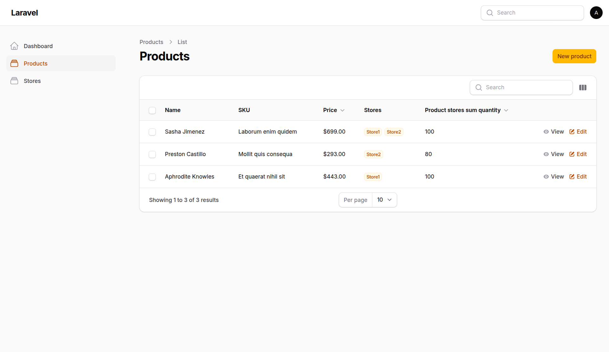
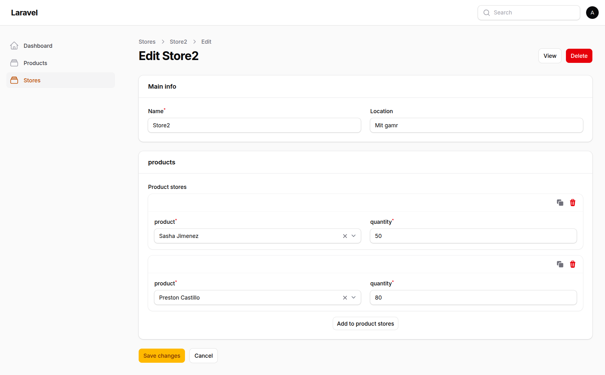

# Filament Inventory Manager 🚀

A robust, optimized, and scalable multi-store inventory management system built with **Laravel 12** and **Filament PHP v5**. This project is crafted as a portfolio piece to demonstrate advanced backend architecture, clean code standards, and efficient database design.

---

## 🛠️ Tech Stack

* **Backend Framework:** Laravel 12 ⚡
* **Admin Panel:** Filament PHP v5 (Powered by Livewire v4) 🎨
* **Database:** MySQL 🗄️
* **OS Environment:** Ubuntu Linux 🐧

---

## ✨ Core Architecture & Key Features

### 1. Advanced Eloquent & Pivot Schema Design
* Implemented a clean **Many-to-Many** relationship between `Products` and `Stores` via a dedicated custom Pivot model (`ProductStore`) extending Laravel's core `Pivot` class.
* Strict database integrity with `cascadeOnDelete()` and a `composite unique key` `['product_id', 'store_id']` at the database level to prevent redundant records.

### 2. High-Performance Database Subqueries (No N+1 Problem)
* The total available stock across all warehouses is aggregated directly at the database level using Laravel's dynamic subqueries `->sum('productStores', 'quantity')`. This ensures **$O(1)$ query execution load** regardless of data scale.

### 3. Bulletproof UX & Data Validation
* Implemented a dynamic `Repeater` form inside the Store Resource allowing seamless in-form inventory adjustment.
* Leveraged Filament's `disableOptionsWhenSelectedInSiblingRepeaterItems()` and `distinct()` constraints to prevent users from selecting the same product multiple times within the same warehouse inventory sheet.
* Enforced strict backend and frontend numeric validation (`minValue(0)`) to ensure inventory counts can never drop into negative values.

---

## 📸 Screenshots & UI Tour

### 🔹 Products Management & Aggregated Stock
Real-time tracking of product listings showing price formatting, assigned badges for active stores, and calculated total stock via optimized subqueries:



### 🔹 Dynamic Store Inventory Form (In-Form Pivot Manipulation)
The reactive inventory sheet where managers allocate products and distinct quantities directly from the store dashboard:



---

## 🗄️ Database Schema Representation

* **`products`:** `id` | `name` | `sku` (Unique Indexed) | `price` | `description` | `timestamps`
* **`stores`:** `id` | `name` | `location` | `timestamps`
* **`product_store` (Pivot):** `id` | `product_id` (FK) | `store_id` (FK) | `quantity` (Default: 0) | `timestamps`

---

## 🚀 Local Installation Guide

Follow these steps to spin up the project locally on your environment (Optimized for Ubuntu Linux):

1. **Clone the repository:**
   ```bash
   git clone git@github.com:hussein-code-lab/filament-inventory-manager.git
   cd filament-inventory-manager
